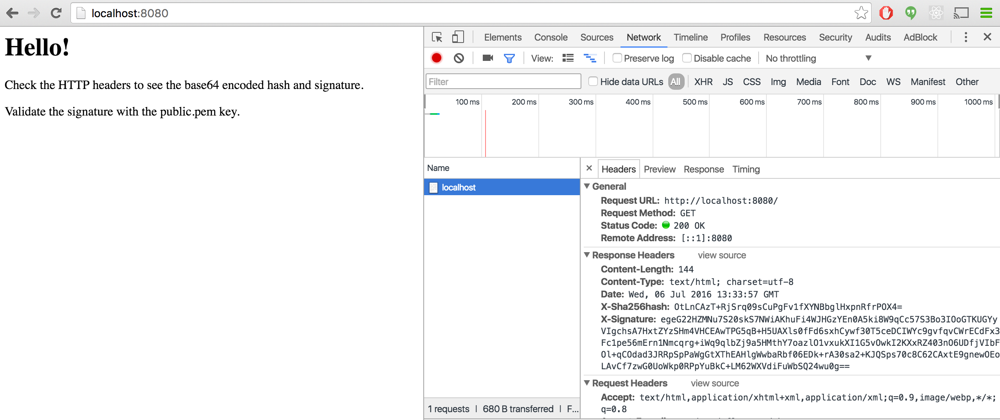

gosign
======

Middleware Which Signs HTTP Reponses Using a Private Key
--------------------------------------------------------



To generate private and public keys:

```
openssl genrsa -out private_test.pem 2048
openssl rsa -in private_test.pem -outform PEM -pubout -out public_test.pem
```

To sign and validate using the command line (to compare against the Go implementation):

```
# SHA256 hash the data.
openssl dgst -sha256 -binary data.json > hash.bin
# base64 encode the hash so that it should match the value of the X-Sha256hash HTTP header.
openssl base64 -e -in hash.bin -out hash.b64

# Sign the hash.
openssl rsautl -in hash.bin -inkey private_test.pem -sign -out signature.bin
# base64 encode the signature so that it should match the value of the X-Signature HTTP header.
openssl base64 -e -in signature.bin -out signature.b64

# Verify the signature.
openssl rsautl -in signature.bin -verify -inkey public_test.pem -pubin > verified.bin
openssl base64 -e -in verified.bin -out verified.b64

# Compare the original hash to the hash created by the verification routine.
# The two files should be equal.
cat hash.b64
cat verified.b64
```
